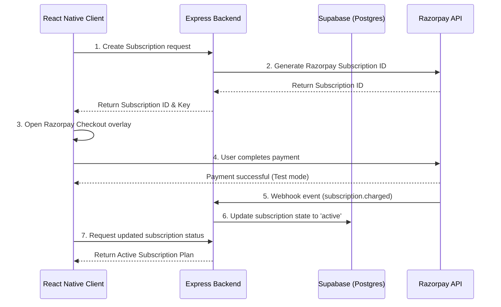

# Gym Management Mobile Application (Monorepo Foundation)

> [!IMPORTANT]
> **MANDATORY RULES FOR ALL DEVELOPERS AND AI AGENTS:**
> 1. **Read this file first** before examining or editing any part of the codebase.
> 2. **Read the referenced documents in order** (see the [Engineering Handbook](docs/README.md) onboarding sequence).
> 3. **Never violate the architecture rules** defined in the [Architecture Constitution](docs/standards/architecture_rules.md).
> 4. **If implementation conflicts with documentation, stop and ask** instead of making assumptions.
>
> 📖 **Engineering Handbook & Documentation**: The complete system architecture, backend/frontend engineering handbook, standards, and ADRs are now organized in the [docs/README.md](docs/README.md) entry point.

> **Status:** 🏗️ Foundational Phase (Core Architecture, Auth, Database Design & RBAC Complete)  
> **Feature Modules Status:** ⏸️ Paused (QR Attendance, Digital Pass, Notifications, and Analytics are paused awaiting final business SRS)  
> **Tech Stack:** React Native CLI, Express.js (TypeScript), Supabase (PostgreSQL + Auth), Upstash Redis, Razorpay, Pino Logger, Zod Validation.

---

## Table of Contents
1. [Project Overview & Architecture](#1-project-overview--architecture)
2. [Folder Structure](#2-folder-structure)
3. [Prerequisites](#3-prerequisites)
4. [Step-by-Step Setup Guide](#4-step-by-step-setup-guide)
   - [Database Migrations (Supabase CLI)](#step-41-database-migrations-supabase-cli)
   - [Backend Configuration](#step-42-backend-configuration)
   - [Frontend Configuration](#step-43-frontend-configuration)
5. [Running the Application](#5-running-the-application)
   - [Starting the Backend](#step-51-starting-the-backend)
   - [Configuring USB Debugging & Port Forwarding](#step-52-configuring-usb-debugging--port-forwarding)
   - [Starting the Metro Packager](#step-53-starting-the-metro-packager)
   - [Running on Android Device](#step-54-running-on-android-device)
6. [Core Architectural Features](#6-core-architectural-features)
   - [Role-Based Access Control (RBAC)](#role-based-access-control-rbac)
   - [Structured Logging (Pino)](#structured-logging-pino)
   - [Global Validation & Errors](#global-validation--errors)
7. [Troubleshooting (Windows-Specific Fixes)](#7-troubleshooting-windows-specific-fixes)

---

## 1. Project Overview & Architecture

This monorepo houses the foundational backend and mobile client for our Gym Management Application:



* **Frontend:** React Native CLI, TypeScript, Zustand (State), Axios (API client), and React Native Razorpay SDK.
* **Backend:** Express.js, TypeScript, Supabase JS Client, Pino Logger, Zod Validation, and Razorpay Node SDK.
* **Database & Auth:** Supabase Auth (JWT user sessions) and PostgreSQL for relational plan, profiles (linked via sync triggers), gym members (role hierarchy), subscriptions, payments, and check-in logs.

---

## 2. Folder Structure

The project uses a monorepo structure separating the client, API, database migrations, and project documentation:

```text
Gym-Management-App/
├── backend/                  # Node.js + Express.js API Server
│   ├── src/                  # TypeScript source files
│   │   ├── controllers/      # Route controllers (webhook, subscription)
│   │   ├── middlewares/      # auth, role-checking, validate, and errors
│   │   ├── routes/           # API routes definitions
│   │   ├── services/         # business layer (Razorpay, Subscription)
│   │   ├── utils/            # Pino logger, AppError helpers
│   │   └── validations/      # Zod validation schemas
│   └── package.json          # Backend dependencies
├── frontend/                 # React Native CLI Mobile Application
│   ├── android/              # Native Android wrapper and Gradle settings
│   ├── ios/                  # Native iOS wrapper and CocoaPods configurations
│   ├── src/                  # React Native source files
│   │   ├── api/              # Supabase Client and Axios instance
│   │   ├── navigation/       # Role-Based navigation stack router
│   │   ├── screens/          # Customer and Owner screens
│   │   ├── store/            # Zustand global state (Auth, Profiles)
│   │   └── types/            # TypeScript environment and library declarations
│   └── package.json          # Frontend dependencies
├── supabase/                 # Version-controlled database migrations
│   ├── migrations/           # SQL migration scripts
│   └── config.toml           # Supabase CLI project configuration
├── schema.sql                # Complete updated PostgreSQL relational schema
└── README.md                 # Project running guide (This file)
```

---

## 3. Prerequisites

Before starting, ensure you have the following installed:
* **Node.js** (LTS version >= 22.11.0)
* **Java Development Kit (JDK)** (version 17, recommended for React Native 0.74+)
* **Android Studio & SDK** (configured with `ANDROID_HOME` environment variables)
* **Supabase CLI** (installed for managing database schemas and triggers)
* A physical Android device with **USB Debugging** enabled, or an active Android Virtual Device (AVD).

---

## 4. Step-by-Step Setup Guide

### Step 4.1: Database Migrations (Supabase CLI)
To set up your database, you can run the version-controlled migrations locally or link them directly to a remote Supabase instance:
1. Copy the full SQL queries from [schema.sql](file:///c:/Users/baodh/OneDrive/Desktop/Projects/Subscription-Management-React-Cli/schema.sql) to set up your tables, enums, triggers, and RLS policies manually in your Supabase SQL editor.
2. Alternatively, to apply migrations remotely using the Supabase CLI:
   ```bash
   # Link to your remote Supabase project
   supabase link --project-ref your-project-reference-id
   
   # Push migrations
   supabase db push
   ```

### Step 4.2: Backend Configuration
1. Navigate to the `backend/` folder:
   ```bash
   cd backend
   ```
2. Create a `.env` file based on `.env.example`:
   ```bash
   cp .env.example .env
   ```
3. Fill in your API keys in the `.env` file:
   ```env
   PORT=5000
   SUPABASE_URL=https://your-project.supabase.co
   SUPABASE_ANON_KEY=your-supabase-anon-key
   SUPABASE_SERVICE_ROLE_KEY=your-supabase-service-role-key # Required for admin db writes
   RAZORPAY_KEY_ID=rzp_test_yourKeyId
   RAZORPAY_KEY_SECRET=yourRazorpaySecret
   RAZORPAY_WEBHOOK_SECRET=yourWebhookSecret # Set this when configuring Razorpay webhooks
   ALLOWED_ORIGINS=http://localhost:3000,http://localhost:5000 # Comma-separated whitelist for CORS (supports '*' in dev)
   ```
4. Install dependencies:
   ```bash
   npm install
   ```

### Step 4.3: Frontend Configuration
1. Navigate to the `frontend/` folder:
   ```bash
   cd frontend
   ```
2. Create a `.env` file containing your local keys (this file is git-ignored):
   ```env
   SUPABASE_URL=https://your-project.supabase.co
   SUPABASE_ANON_KEY=your-supabase-anon-key
   API_BASE_URL=http://localhost:5000
   ```
3. Install frontend dependencies:
   ```bash
   npm install
   ```
   *(Note: The application uses `react-native-dotenv` to dynamically read configuration values directly from `frontend/.env` during build).*

---

## 5. Running the Application

### Step 5.1: Starting the Backend
Open a terminal in the root directory and run:
```bash
cd backend
npm run dev
```
*This launches the API server on `http://localhost:5000` with hot-reloading.*

### Step 5.2: Configuring USB Debugging & Port Forwarding
1. Connect your physical Android phone to your PC via USB.
2. Verify it is recognized by running:
   ```bash
   adb devices
   ```
3. Forward port `5000` so that requests to `localhost:5000` inside your phone are routed to your local computer's backend:
   ```bash
   adb reverse tcp:5000 tcp:5000
   ```

### Step 5.3: Starting the Metro Packager
Open a new terminal in the root directory and run:
```bash
cd frontend
npm run start
```
*This launches Metro (on default port `8081`) to serve the compiled JavaScript bundle.*

### Step 5.4: Running on Android Device
Open a third terminal in the root directory and deploy the app:
```bash
cd frontend
npx react-native run-android --no-packager
```

---

## 6. Core Architectural Features

### Role-Based Access Control (RBAC)
* **Backend Middleware:** The `checkRole` middleware in [auth.ts](file:///c:/Users/baodh/OneDrive/Desktop/Projects/Subscription-Management-React-Cli/backend/src/middlewares/auth.ts) restrict endpoints based on profile roles (`customer`, `owner`, `admin`).
* **Frontend Routing:** The [AppNavigator.tsx](file:///c:/Users/baodh/OneDrive/Desktop/Projects/Subscription-Management-React-Cli/frontend/src/navigation/AppNavigator.tsx) separates stacks based on the authenticated user's role. Customers see the dashboard and membership options, while owners are redirected to the dedicated `OwnerDashboard`.

### Structured Logging (Pino)
* **structured logging:** The application utilizes Pino in [logger.ts](file:///c:/Users/baodh/OneDrive/Desktop/Projects/Subscription-Management-React-Cli/backend/src/utils/logger.ts) to produce high-performance, structured JSON logging in production and readable colorized logs in development.

### Global Validation & Errors
* **Payload Validation:** Leverages Zod schemas with Express middlewares to automatically validate client body, query, and path parameters, returning descriptive validation errors to clients.
* **AppError Exception Handler:** Includes a custom `AppError` class that tags expected failures, filtering out database stack traces from clients during unexpected runtime server errors.

---

## 7. Troubleshooting (Windows-Specific Fixes)

### Windows Path Length Error (`build.ninja still dirty`)
During native Android builds on Windows, paths can exceed the 260-character maximum length limit, causing CMake/Ninja compilation of C++ elements (such as `react-native-screens`) to crash or loop infinitely.

**How we fixed this in this project:**
We added a global directory redirection script inside [frontend/android/settings.gradle](file:///c:/Users/baodh/OneDrive/Desktop/Projects/Subscription-Management-React-Cli/frontend/android/settings.gradle). This forces the compilation objects of all library subprojects to write to short paths in `C:\tmp\cxx\`:
```groovy
gradle.beforeProject { project ->
    project.plugins.withId("com.android.library") {
        if (project.android.hasProperty("externalNativeBuild")) {
            project.android.externalNativeBuild.cmake {
                buildStagingDirectory = file("C:/tmp/cxx/${project.name}")
            }
        }
    }
}
```

If you ever run into Ninja loop issues or lockouts, simply clean your build cache:
```bash
# In a powershell terminal
Stop-Process -Name java -Force # Stops locked Gradle/Java processes
Remove-Item -Path C:/tmp/cxx -Recurse -Force # Deletes old CMake caches
cd frontend/android
./gradlew clean
```
