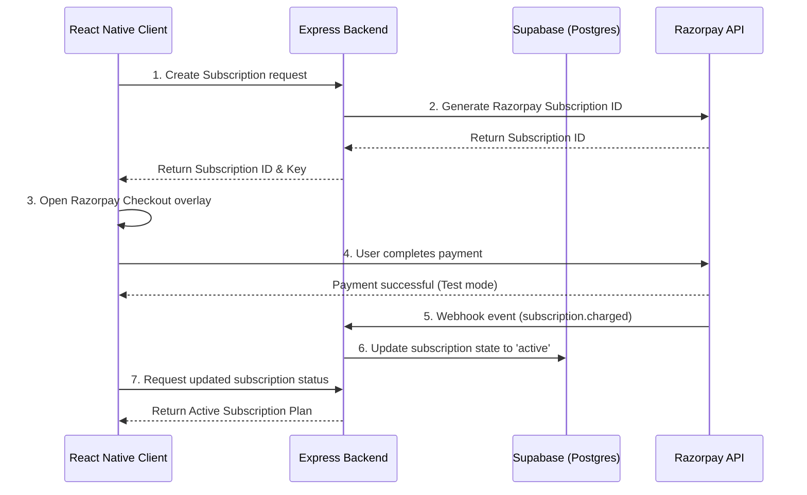

# Subscription Management System (Prototype Monorepo)

> **Status:** 🧪 Prototype / Proof of Concept (POC)  
> **Purpose:** A prototype application demonstrating a secure, production-grade subscription management architecture using **React Native CLI (Frontend)**, **Express.js (Backend)**, **Supabase (PostgreSQL Database & Auth)**, and **Razorpay Subscriptions & Webhooks**.

---

## Table of Contents
1. [Project Overview & Architecture](#1-project-overview--architecture)
2. [Folder Structure](#2-folder-structure)
3. [Prerequisites](#3-prerequisites)
4. [Step-by-Step Setup Guide](#4-step-by-step-setup-guide)
   - [Database Setup (Supabase)](#step-41-database-setup-supabase)
   - [Backend Configuration](#step-42-backend-configuration)
   - [Frontend Configuration](#step-43-frontend-configuration)
5. [Running the Application](#5-running-the-application)
   - [Starting the Backend](#step-51-starting-the-backend)
   - [Configuring USB Debugging & Port Forwarding](#step-52-configuring-usb-debugging--port-forwarding)
   - [Starting the Metro Packager](#step-53-starting-the-metro-packager)
   - [Running on Android Device](#step-54-running-on-android-device)
6. [Testing Razorpay Webhooks Locally](#6-testing-razorpay-webhooks-locally)
7. [Troubleshooting (Windows-Specific Fixes)](#7-troubleshooting-windows-specific-fixes)

---

## 1. Project Overview & Architecture

This prototype handles the subscription lifecycle securely using a decoupled client-server architecture:



* **Frontend:** React Native CLI, TypeScript, Zustand (State), Axios (API client), and React Native Razorpay SDK.
* **Backend:** Express.js, TypeScript, Supabase JS Client, and Razorpay Node SDK.
* **Database & Auth:** Supabase Auth (JWT generation and user sessions) and PostgreSQL for relational plan, subscription, and transaction schemas.

---

## 2. Folder Structure

The project uses a monorepo structure separating the client, API, and project documentation:

```text
Subscription-Management-React-Cli/
├── backend/                  # Node.js + Express.js API Server
│   ├── src/                  # TypeScript source files (controllers, routes, etc.)
│   └── package.json          # Backend npm package definition
├── frontend/                 # React Native CLI Mobile Application
│   ├── android/              # Native Android wrapper and Gradle settings
│   ├── ios/                  # Native iOS wrapper and CocoaPods configurations
│   ├── src/                  # React Native TypeScript components and State
│   └── package.json          # Frontend npm package definition
├── SYSTEM_DESIGN.md          # Database schemas, API routes, and design choices
├── schema.sql                # SQL initialization queries for PostgreSQL/Supabase
└── README.md                 # Project running guide (This file)
```

---

## 3. Prerequisites

Before starting, ensure you have the following installed:
* **Node.js** (LTS version >= 22.11.0)
* **Java Development Kit (JDK)** (version 17, recommended for React Native 0.74+)
* **Android Studio & SDK** (installed and configured with `ANDROID_HOME` environment variables)
* **Git**
* A physical Android device with **USB Debugging** enabled, or an active Android Virtual Device (AVD).

---

## 4. Step-by-Step Setup Guide

### Step 4.1: Database Setup (Supabase)
1. Go to [Supabase](https://supabase.com) and create a free project.
2. In the Supabase Dashboard, go to **SQL Editor**.
3. Copy the SQL queries from [schema.sql](file:///c:/Users/baodh/OneDrive/Desktop/Projects/Subscription-Management-React-Cli/schema.sql) and run them to create the `plans`, `subscriptions`, and `payments` tables and enable Row-Level Security (RLS).
4. Note your **Project URL** and **Anon Key** from **Project Settings > API**.

### Step 4.2: Backend Configuration
1. Go to the `backend/` folder:
   ```bash
   cd backend
   ```
2. Create a `.env` file based on `.env.example`:
   ```bash
   cp .env.example .env
   ```
3. Fill in your API keys in the `.env` file:
   ```env
   PORT=5000
   SUPABASE_URL=https://your-project.supabase.co
   SUPABASE_ANON_KEY=your-supabase-anon-key
   SUPABASE_SERVICE_ROLE_KEY=your-supabase-service-role-key # Required for admin db writes
   RAZORPAY_KEY_ID=rzp_test_yourKeyId
   RAZORPAY_KEY_SECRET=yourRazorpaySecret
   RAZORPAY_WEBHOOK_SECRET=yourWebhookSecret # Set this when configuring Razorpay webhooks
   ```
4. Install dependencies:
   ```bash
   npm install
   ```

### Step 4.3: Frontend Configuration
1. Go to the `frontend/` folder:
   ```bash
   cd frontend
   ```
2. Create/edit the configuration file `frontend/src/config.ts` and set your API base and Supabase credentials:
   ```typescript
   export const API_BASE_URL = 'http://localhost:5000'; // Port-forwarded backend endpoint
   export const SUPABASE_URL = 'https://your-project.supabase.co';
   export const SUPABASE_ANON_KEY = 'your-supabase-anon-key';
   ```
3. Install frontend dependencies:
   ```bash
   npm install
   ```

---

## 5. Running the Application

Follow these steps in separate terminal windows to launch both systems simultaneously.

### Step 5.1: Starting the Backend
Open a terminal in the root directory and run:
```bash
cd backend
npm run dev
```
*This launches the API server on `http://localhost:5000`.*

### Step 5.2: Configuring USB Debugging & Port Forwarding
1. Connect your physical Android phone to your PC via USB.
2. Verify it is recognized by running:
   ```bash
   adb devices
   ```
3. Forward port `5000` so that requests to `localhost:5000` inside your phone are routed to your local computer's backend:
   ```bash
   adb reverse tcp:5000 tcp:5000
   ```

### Step 5.3: Starting the Metro Packager
Open a new terminal in the root directory and run:
```bash
cd frontend
npm run start
```
*This launches Metro (on default port `8081`) to serve the compiled JavaScript bundle.*

### Step 5.4: Running on Android Device
Open a third terminal in the root directory and deploy the app:
```bash
cd frontend
npx react-native run-android --no-packager
```
*The `--no-packager` option prevents compiling scripts from opening a duplicate terminal.*

---

## 6. Testing Razorpay Webhooks Locally

Since Razorpay's checkout is performed via their cloud service, Razorpay needs to send transaction updates (like `subscription.charged` or `payment.captured`) to a public URL.

To test this on your local machine:
1. Run localtunnel to generate a public proxy endpoint pointing to your Express server:
   ```bash
   npx localtunnel --port 5000
   ```
2. Copy the generated URL (e.g., `https://three-tools-tap.loca.lt`).
3. Go to the **Razorpay Dashboard > Settings > Webhooks**.
4. Click **Add New Webhook** and fill in details:
   - **Webhook URL:** `https://your-localtunnel-url.loca.lt/api/webhooks/razorpay`
   - **Secret:** Use the same secret defined as `RAZORPAY_WEBHOOK_SECRET` in your backend `.env`.
   - **Active Events:** Choose `subscription.charged`, `subscription.activated`, and `subscription.halted`.
5. Trigger a subscription checkout in test mode inside the app. The backend will receive the transaction confirmation hook automatically and update your plan!

---

## 7. Troubleshooting (Windows-Specific Fixes)

### Windows Path Length Error (`build.ninja still dirty`)
During native Android builds on Windows, paths can exceed the 260-character maximum length limit, causing CMake/Ninja compilation of C++ elements (such as `react-native-screens`) to crash or loop infinitely.

**How we fixed this in this project:**
We added a global directory redirection script inside [frontend/android/settings.gradle](file:///c:/Users/baodh/OneDrive/Desktop/Projects/Subscription-Management-React-Cli/frontend/android/settings.gradle). This forces the compilation objects of all library subprojects to write to short paths in `C:\tmp\cxx\`:
```groovy
gradle.beforeProject { project ->
    project.plugins.withId("com.android.library") {
        if (project.android.hasProperty("externalNativeBuild")) {
            project.android.externalNativeBuild.cmake {
                buildStagingDirectory = file("C:/tmp/cxx/${project.name}")
            }
        }
    }
}
```

If you ever run into Ninja loop issues or lockouts, simply clean your build cache:
```bash
# In a powershell terminal
Stop-Process -Name java -Force # Stops locked Gradle/Java processes
Remove-Item -Path C:/tmp/cxx -Recurse -Force # Deletes old CMake caches
cd frontend/android
./gradlew clean
```
